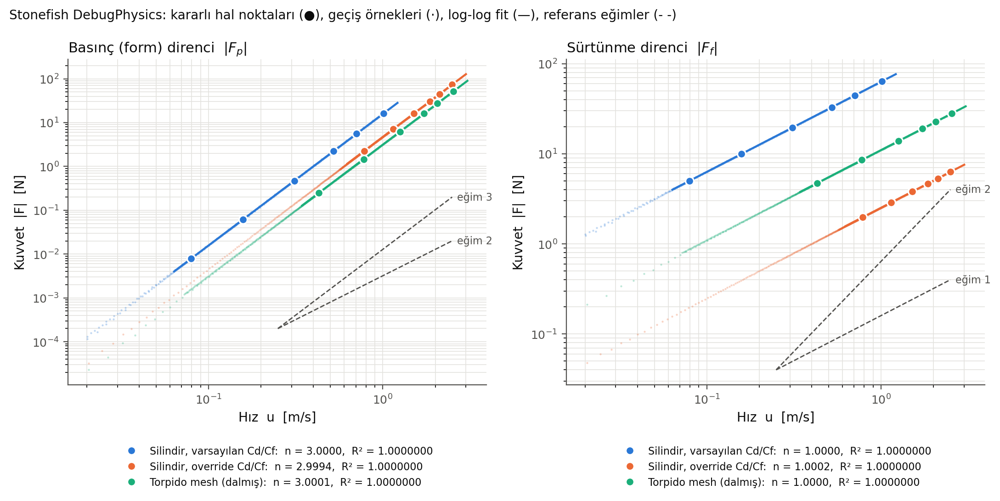
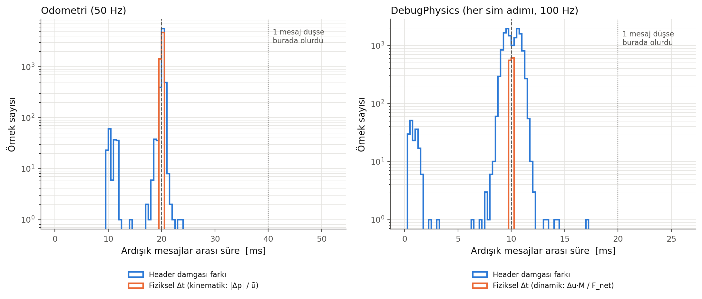
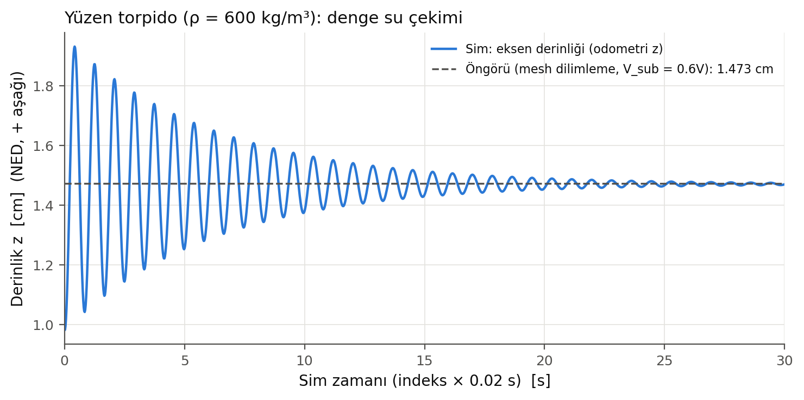

# Faz 0.5: Doğrulama

Tarih: 2026-10-04. Stonefish `b21eb8e` (= upstream `master`), stonefish_ros2 `6646e7a`. Kaynak koda **hiçbir düzeltme yapılmadı**.

Kısaltmalar: `SF` = `~/stonefish/Library/src`, `SR` = `~/stonefish_ws/src/stonefish_ros2/src/stonefish_ros2`, `P` = `docs/probe`.

## Deney düzeni

| Koşu | Mod | Senaryo | İçerik |
|---|---|---|---|
| R1 | GUI (NVIDIA offload), 100 Hz | `P/probe_phase0b.scn` | 4 robot; 5/10/20/35/50/80 N, her biri 20 s, sonra 0 N 10 s |
| R2 | nogpu, 100 Hz | aynı | R1'in tekrarı |
| R3 | GUI, 500 Hz | `P/probe_phase0.scn` | 20 N ve 50 N, 15'er s (burst altında mesaj düşmesi testi) |
| R4 | nogpu, `use_sim_time` true/false | `P/probe_phase0.scn` | `/clock` ve sim ilerlemesi |

R1/R2'deki robotlar (aralarında 3 m y mesafesi):
- `cyl_def`: silindir r=0.1 m, L=1 m, ρ=1000, varsayılan C_d/C_f.
- `cyl_ovr`: aynı silindir, `<hydrodynamics>` override.
- `torp_sub`: tek parça torpido mesh'i, nötr, 5 m'de.
- `torp_flt`: aynı mesh, ρ=600, yüzeyde serbest.

Araçlar:
- `P/run_probe.sh`: sim + bag + itki basamakları.
- `P/thrust_steps.py`: itki basamaklarını yayınlar.
- `P/make_torpedo_obj.py`: torpido mesh üreticisi.
- `P/analyze_phase0b.py`: tüm analiz ve grafikler.
- `P/run_simtime_test.sh`: R4.

Ham sonuçlar `P/bags/phase0b_results.json` dosyasında (bag'ler git'e girmiyor). R1 ve R2 sonuçları 4–5 haneye kadar aynı; tablolarda R1 verildi.

---

## 1. Direnç üssü

**Bulgu.** Stonefish'te basınç (form) direnci hızın **küpüyle**, sürtünme direnci hızla **lineer** ölçekleniyor. Üç farklı gövdede (iki farklı katsayı seti ve mesh) aynı sonuç:

| Gövde | u aralığı [m/s] | n_p (F_p) ±%95 | R² | n_f (F_f) ±%95 | R² |
|---|---|---|---|---|---|
| cyl_def | 0.079 – 1.012 | **3.00000 ± 0.00001** | 1.0000000 | **1.00000 ± 0.00001** | 1.0000000 |
| cyl_ovr | 0.782 – 2.501 | **2.99938 ± 0.00071** | 1.0000000 | **1.00018 ± 0.00019** | 1.0000000 |
| torp_sub | 0.430 – 2.550 | **3.00007 ± 0.00001** | 1.0000000 | **1.00003 ± 0.00002** | 1.0000000 |

Tüm geçiş örnekleriyle yapılan yoğun fit (N ≈ 12–13 bin, u > 0.02 m/s): n_p = 3.0000 / 3.0077 / 3.0022, n_f = 1.0000 / 1.0026 / 1.0007, R² ≥ 0.99998.

**Kanıt ve yöntem**
- F_p = `damping.force.x`, F_f = `skin_friction.force.x` (`<ros_debug physics>`). u = DebugPhysics gövde hızı. Her seviyenin son 5 s ortalaması alındı ve `log10|F| = n·log10 u + c` doğrusal fiti yapıldı. Fit formülden bağımsız; kaynak koddaki formül hiç kullanılmadı.
- **Hız çapraz kontrolü:** Odometri twist'i ve odometri konum eğimi (indeks × 0.02 s) DebugPhysics hızıyla 4 haneye kadar aynı. Tek istisna `cyl_ovr` 5 N noktası: 0.7818 / 0.7819 / 0.7829 m/s, aşağıdaki kararlılık notuna bakın.
- **Kararlılık** (|u̇|·M/T): `cyl_ovr` 5 N noktası **%15.4** (20 s'de kararlı hale gelmedi; düşük direnç, τ ≈ 5 s), `torp_sub` 5 N %0.5, diğerleri < %0.3. F(u) anlık hıza bağlı olduğu için bu, üs fitini etkilemiyor; ama o nokta T = |F_p|+|F_f| dengesi için kullanılamaz.
- Yoğun fitteki küçük sapma (`cyl_ovr` 3.008): Kuvvetler 50 Hz'de güncelleniyor ve aradaki adımlarda sabit tutuluyor (Madde 4). Hızlı ivmelenmede raporlanan kuvvet 1–2 adım önceki hıza ait oluyor. Mekanizma koddan doğrulandı; sapmayı tamamen buna bağlamak **doğrulanmadı**. Kararlı hal noktalarında bu etki yok.
- Grafik: `figures/faz0b/00b_loglog_direnc.{png,pdf}`



**Faz 1'e etkisi.** Faz 4'teki "Stonefish modeli" şu olmalı:

    (m + m̄_a)·u̇ = T − ½ρ·C_d,x·A_ön·|u|³ − ρ·C_f,x·S_t·u

Fiziksel (ITTC) model ise u²'li. İki model ancak tek bir hız civarında eşleştirilebilir (Madde 3).

---

## 2. Birim analizi ve upstream durumu

**Bulgu.** Form terimi boyutsal olarak tutarsız; büyük olasılıkla 2024'te girmiş bir hata. Sürtünme terimi tutarlı, ama yalnızca C_f'ye [m/s] birimi verilirse; kasıtlı bir "viskoz" model gibi görünüyor.

**Terimler ve birimleri** (`SF/entities/SolidEntity.cpp`)

| Terim | Kod | Ham yüz katkısı | Birim | Ölçekleme | Sonuç |
|---|---|---|---|---|---|
| Form | `:1776-1779`: `vc*sqrt(|vc|²)*(-vc_n)*A`, `vc_n = dot(vc, n̂)` [m/s] | v·\|v\|·(−v_n)·A | m⁵/s³ | `½ρC_d·Σ` (`:1271`) | kg·m²/s³ = **N·(m/s)**. N olması için C_d'nin [s/m] olması gerekir; C_d boyutsuz olamıyor |
| Sürtünme | `:1787`: `vt*A` | v_t·A | m³/s | `ρC_f·Σ` (`:1281`) | kg/s·C_f → N için **C_f [m/s]** |

- **Form için kastedilen büyük olasılıkla şu:** `-vc_n/|vc|` = cosθ, yani izdüşüm alanı. O zaman Σ = |v|²·v̂·A_izdüşüm ve F = ½ρC_dA|v|² olur (boyutsuz C_d, kuadratik). Stonefish'in sonucu kuadratik formun |u| katı. Sayısal olarak u < 1 m/s'de eksik, u > 1 m/s'de fazla direnç veriyor; ikisi yalnızca u = 1 m/s'de çakışıyor.
- **Sürtünme fiziksel yorumu:** Couette kayma gerilmesi τ = μu/δ alınırsa F = ρ(ν/δ)·S·u olur, yani C_f = ν/δ. Varsayılan C_f = 0.1 m/s, δ ≈ 1e-6/0.1 = **10 µm** sınır tabaka kalınlığına denk geliyor. Bu gerçekçi değil (gerçekte mm–cm mertebesinde). Faz 0'daki ITTC'nin 54–102 katı farkın açıklaması bu. Viskozite (μ = 1.308e-3, `SF/core/ScenarioParser.cpp:667`) saklanıyor ama hiçbir direnç hesabında kullanılmıyor.

**Git geçmişi**
- `git blame`: kübik satır `12ed0e11` ile gelmiş (2024-02-06, Patryk Cieślak, *"Added missing compound part physics mode logics and changed calculation of quadratic drag."*).
- Diff:
  ```
  -  glm::vec3 vn = glm::dot(vc, fn1) * fn1;
  -  GLfloat vmag2 = glm::length2(vn);
  -  glm::vec3 quadratic = vn * sqrtf(vmag2) * A;        // v_n·|v_n|·A  -> kuadratik
  +  GLfloat vc_n = glm::dot(vc, fn1);
  +  GLfloat vmag2 = glm::length2(vc);
  +  glm::vec3 quadratic = vc * sqrtf(vmag2) * -vc_n * A; // v·|v|·v_n·A -> kübik
  ```
  Aynı değişiklik hem dalmış (`:1776-1779`) hem yüzey (`:1668-1671`) dalında var.
- **Upstream'in son durumu:** yerel HEAD = `origin/master` = `b21eb8e` (`git ls-remote`, 2026-10-04). `refactoring` ve `jonswap` dallarında da aynı satır var (raw.githubusercontent.com).
- **Issue'lar:**
  - GitHub search API'de "quadratic OR cubic OR skin OR viscous" için 5 sonuç çıktı; hiçbiri bu konuyla ilgili değil.
  - #63 ("Possible Error in drag calculation in v1.4"): compound gövdelerde x/y asimetrisi; `5d7ad55` ile düzeltildi; kübik terimle ilgisi yok.
  - #62 (açık, cevapsız): "referans alan ıslak alan mı, izdüşüm alanı mı?"
  - Kübik terimi raporlayan bir issue **bulunamadı**.

**Bug olasılığı: yüksek.** Gerekçeler:
1. Boyutsal tutarsızlık.
2. Kod yorumu "0.5\*rho\*Cd\*S\*v2" diyor (`:1271`).
3. Dokümanda "form drag (quadratic)" yazıyor (`~/stonefish/docs/theory.rst`).
4. Commit mesajı "quadratic drag" diyor.
5. Önceki sürüm kuadratikti.

Kasıtlı olduğunu gösteren bir işaret bulamadım. Kesin hüküm upstream'in cevabına bağlı; **doğrulanmadı**. Düzeltme yapılmadı.

**Yan bulgu (kullanmıyoruz):** Hava direnci yolunda `quadratic = vn * vn.length() * A` (`:1913`) var. GLM'de `vec3::length()` bileşen sayısını, yani 3'ü döndürüyor (`/usr/include/glm/detail/type_vec3.hpp:91`). Aerodinamik "kuadratik" direnç aslında 3·v_n·A, yani lineer.

**Faz 1'e etkisi.**
- Raporda "Stonefish = implementasyon, ITTC = fizik" ayrımı korunacak.
- Kübik terim için hocaya ve rapora açık bir not düşülecek.
- İstenirse upstream'e issue açılabilir. Bu dış dünyaya gönderim olduğu için senin kararın.

---

## 3. C_d ve C_f gövde başına ayarlanabiliyor mu?

**Bulgu.** Evet. Etiket: `<hydrodynamics viscous_drag="Cf_x Cf_y Cf_z" quadratic_drag="Cd_x Cd_y Cd_z"/>`. Gövde tanımının içine yazılıyor (`<dynamic>` ya da robot `<base_link>`/`<link>`).

| Konu | Kaynak |
|---|---|
| Parse | `SF/core/ScenarioParser.cpp:1953-1959` (`viscous_drag` → C_f, `quadratic_drag` → C_d) |
| Uygulama | `:2123` `solid->SetHydrodynamicCoefficients(Cd, Cf)`. Otomatik yaklaşım katsayılarının üstüne yazıyor |
| Robot link'leri | `ParseLink` → `ParseSolid` (`:2333-2335`), yani geçerli |
| Compound | Gövde seviyesinde **parse edilmiyor** (`:1836-1904`). Sadece parça başına, çünkü direnç parça katsayısıyla hesaplanıyor (`SF/entities/solids/Compound.cpp:338-339`) |
| Geçerlilik | Üç bileşenin **hepsi ≥ 0** olmalı. Değilse vektör **sessizce** yok sayılıyor ve varsayılan kalıyor (`SolidEntity.cpp:192-198`). Bu iki öznitelik birbirinden bağımsız ve opsiyonel |
| Eksenler | Link origin (O) frame'i. Etkin katsayı `C_eff = Σ|d_i|·C_i`, d = ham kuvvet yönü (O frame'inde) (`SolidEntity.cpp:1263-1287`) |
| C++ | `SolidEntity::SetHydrodynamicCoefficients(Cd, Cf)` |
| **Ayarlanamayanlar** | Fonksiyon biçimi (u³ ve u), ek kütle, MVAE/silindir yaklaşımı. XML'de karşılıkları yok |

**Canlı kanıt (R1)**
- `cyl_ovr` DebugPhysics: `damping_coeff` = (0.3, 0.9, 0.9), `skin_friction_coeff` = (0.004, 0.02, 0.02). Override değerleriyle birebir.
- K_p = |F_p|/u³: varsayılan 15.70867, override 4.71250 → oran **0.29999** (C_d oranı 0.3). Formül ½ρC_dA = 15.70796 (+%0.005).
- K_f = |F_f|/u: varsayılan 62.93305, override 2.51734 → oran **0.04000** (C_f oranı 0.04). Formül ρC_fS_t = 62.9331.

**Faz 1'e etkisi.**
- C_d ve C_f gerekçeli değerlere çekilebilir, ama fonksiyon biçimi sabit kalıyor.
- Önerilen kalibrasyon (Faz 1'de değerlendirilecek). Fiziksel direnç tasarım hızı u\* civarında R ≈ k·u² ise, Stonefish'in `a·u³ + b·u` formu değer ve eğim eşlenerek ayarlanabilir: `a = k/(2u*)`, `b = k·u*/2`.
- Bu ayar `C_d,x = 2a/(ρA_ön)` ve `C_f,x = b/(ρS_t)` demek. Oran hatası R_s/R_p = (u/u\* + u\*/u)/2 ≥ 1: u\*'ın %80–120'sinde < %2.5, %70–130'unda < %6.5, u\*/2 veya 2u\*'da %25.
- Bu bir türetim; canlı test edilmedi.

---

## 4. Zaman tabanı

**Bulgular**

| Soru | Cevap | Kanıt |
|---|---|---|
| Köprü `/clock` yayınlıyor mu? | **Hayır.** Publisher sayısı 0 | `ros2 topic info /clock` (R4). Kaynakta `rosgraph_msgs` ve `/clock` publisher'ı yok |
| `use_sim_time:=true` damgaları düzeltiyor mu? | **Hayır, sim'i donduruyor.** 6 s'de 0 odometri ve 0 debug mesajı; 20 N komutu da etkisiz. `false` ile aynı sürede 256 odometri ve 515 debug mesajı geliyor | `P/run_simtime_test.sh true/false`. Sim saati `nh_->get_clock()->now()` (`SR/ROS2SimulationManager.cpp:93-97`); `/clock` gelmediği için 0'da kalıyor |
| Damgalar duvar saati mi? | **Evet.** damga − bag alım zamanı = −0.13 ± 0.07 ms | R1/R2/R3. `now()` publish anında çağrılıyor (`SR/ROS2Interface.cpp:273`) |
| Damgalar türev için uygun mu? | **Hayır.** Burst halinde geliyorlar | Odometri dt std 1.5 ms (min 9.6, max 23.7 ms; nogpu'da min 1.6, max 36.9 ms). Debug dt std 1.2 ms, min 0.37 ms. 500 Hz'de min 0.08 ms |
| Mesaj düşüyor mu? | **Hayır**, üç koşunun hiçbirinde | Aşağıdaki tablo |
| Sim gerçek zamanlı mı? | Evet, RTF = 0.99999 / 0.99995 / 1.00002 | (N_debug − 1)·Δt / duvar süresi |

| Koşu | Debug gelen / beklenen | Odometri gelen / beklenen | Fiziksel Δt, debug | Fiziksel Δt, odometri | Düşme |
|---|---|---|---|---|---|
| R1 GUI 100 Hz | 13502 / 13502.0 | 6751 / 6751.0 | 10.000000 ms ± 3e-12 | 20.000 ± 0.019 ms (max 20.10) | 0 / 0 |
| R2 nogpu 100 Hz | 13488 / 13488.7 | 6744 / 6744.4 | 10.000000 ms ± 3e-12 | 20.000 ± 0.019 ms | 0 / 0 |
| R3 GUI 500 Hz | 20247 / 20246.5 | 2025 / 2024.9 | 2.000000 ms ± 9e-13 | 20.000 ± 0.009 ms | 0 / 0 |

"Beklenen" = rate × duvar süresi + 1. Fiziksel Δt, formülden bağımsız iki yoldan hesaplandı:
- **Kinematik:** odometride `|Δp| / ū` (u > 0.05 m/s örnekler).
- **Dinamik:** DebugPhysics'te `Δu·M / F_net` (|F_net| > 2 N).

Bir mesaj düşseydi bu Δt 2×nominal'de görünürdü; hiç görünmedi.

Ek bulgu: **Hidrodinamik kuvvetler her adımda değil, `round(rate/50)` adımda bir yeniden hesaplanıyor**, yani sim hızından bağımsız olarak 50 Hz (`SF/core/SimulationManager.cpp:582, 1584-1585`). Aradaki adımlarda sabit tutuluyor. DebugPhysics'te mesaj `i+1`'deki kuvvet, `u_i → u_{i+1}` değişimine karşılık geliyor; bu hizalama veriden seçildi.

Grafik: `figures/faz0b/00b_zaman_tabani.{png,pdf}`.



**Sonuç: türev için güvenilir zaman kaynağı.** DebugPhysics'in **mesaj indeksi × Δt_sim** (Δt_sim = 1/simulation_rate) kullanılacak; DebugPhysics her sim adımında bir kez yayınlanıyor. Sensörlerde indeks × (1/sensör_rate). Header damgaları sadece topic'ler arası kaba hizalamada (±birkaç ms) kullanılacak.

Her koşuda iki doğrulama otomatik yapılacak: sayım kontrolü (N ≈ rate × süre) ve fiziksel Δt kontrolü (2×nominal'de örnek yok). İleride `/clock` ya da sim-zamanlı damga gerekirse stonefish_ros2'de yama gerekir; bu senin onayına bağlı.

**Faz 1'e etkisi.**
- Faz 3'teki `bag_to_csv` zaman eksenini indeksten üretecek ve düşme kontrolünü içerecek.
- `use_sim_time` kullanılmayacak.
- Kuvvet güncellemesi 50 Hz olduğu için sim hızını 100 Hz'in üstüne çıkarmak hidrodinamiği daha sık güncellemiyor (prescaler buna göre büyüyor).

Not: R1–R3 sırasında senin açtığın `ros2 topic echo /probe/debug/physics --field damping.force` (PID 24990) çalışıyordu. Fazladan bir abone; etkisi görülmedi.

---

## 5. Compound kullanmadan tek parça gövde

**Bulgu.** Hazır bir elipsoid ya da torpido primitive'i **yok**. Mevcut primitive'ler: `box, cylinder, sphere, torus, wing` (`SF/core/ScenarioParser.cpp:1972-2053`). `model` için ölçek tek skaler, yani küre uzatılarak elipsoid yapılamıyor. Compound da hatalı (Faz 0). Bu yüzden **kapalı (watertight) ve yönleri tutarlı tek bir mesh** gerekiyor.

**Mesh gereksinimleri (koddan)**
- Format OBJ (`v`, `vn`, `f v//vn`) ya da STL (`SF/utils/GeometryFileUtil.cpp:37-284`).
- Yol, data dizinine göre ya da mutlak (`/...`) verilebiliyor (`ScenarioParser.cpp:5131-5136`; `~` açılmıyor). ROS tarafında `$(find paket)` desteği var (`SR/ROS2ScenarioParser.cpp:105-126`).
- Hacim, CG ve atalet işaretli tetrahedronlarla (`GeometryFileUtil.cpp:335`); yüz normalleri `(p2−p1)×(p3−p1)` ile hesaplanıyor. Bu yüzden **dışa dönük CCW sarım** şart.
- Yükleyicide kapalılık ya da yön **kontrolü yok**; bozuk mesh sessizce yanlış hacim verir. Kontrol bizim üreticide yapılmalı.
- `Refine`, alanı ortalamanın 3 katından büyük yüzleri 4'e bölüyor; geometri korunuyor (`OpenGLContent.cpp:2833`).
- Hidrodinamik yaklaşım AUTO = MVAE elipsoidi. Torpidoda bulunan varsayılanlar C_d = (0.2, 1, 1) (= b/a ile 0.1/0.5) ve C_f = 0.1·C_d.

**Test mesh'i** (`P/make_torpedo_obj.py` → `P/meshes/torpedo_L1_D02.obj`)
- Geometri: L=1.0 m, D=0.2 m; burun yarı-elipsoid 0.2 m + silindir 0.5 m + kıç yarı-elipsoid 0.3 m.
- Çözünürlük: 64 açısal dilim, 3650 köşe, 7296 üçgen.
- Kontroller: Her yönlü kenar bir kez kullanılıyor ve tersi mevcut; V−E+F = 2; işaretli hacim > 0.
- Mesh ile analitik arası fark (çokgen yaklaşımı): V −%0.203, S −%0.074, A_ön −%0.161.

**Canlı sonuçlar (R1; R2 aynı)**

| Kontrol | Sim | Bağımsız referans | Fark |
|---|---|---|---|
| Hacim | 0.0261267115 m³ | mesh (Python) 0.0261267114 | 2e-9 |
| Yüzey | 0.5755926154 m² | mesh 0.5755926150 | 6e-10 |
| Tam dalmış F_b | −256.30304 N | −ρgV_mesh = −256.30304 | 2e-9 |
| F_p (6 seviye, 0.43–2.55 m/s) | — | ½ρ·0.2·A_ön,mesh·u³ (A_ön = 0.031365 m²) | ±%0.008 |
| F_f (6 seviye) | — | ρ·0.02·S_t,mesh·u (S_t = 0.549343 m²) | ±%0.004 |
| Yüzen V_sub (ρ=600, son 40 s) | 0.01567603 m³ | ölçülen pozda gövde-x dilimleme + çokgen kırpma: 0.01567602 | 5e-7 |
| Yüzen kuvvet dengesi | F_b = 153.7818 N | m·g = 153.7818 N | 2e-8 |
| Denge eksen derinliği | 1.4715 cm | roll=pitch=0 için öngörü (V_sub = 0.6V): 1.4727 cm | 0.012 mm |

Yüzen torpidoda roll 2.84° (eksenel simetrik gövde roll'da nötr, serbestçe kayıyor), pitch −0.07°. Dilimleme hesabı tüm pozu (z, roll, pitch) hesaba katıyor. Yüzeyde heave salınımı ~0.85 s periyotla yavaş sönüyor (≈30 s).

Grafik: `figures/faz0b/00b_mesh_yuzen.{png,pdf}`.



**Faz 1'e etkisi.**
- Gövde, Python ile üretilen tek parça kapalı mesh olacak. Bu üretici temel alınıp parametreleri YAML'den gelecek.
- V, S, A_ön, S_t ve CB analitik olarak ve mesh-tam olarak bilinecek; Stonefish bunları 1e-8 seviyesinde birebir kullanıyor. Kaldırma ve direnç (Stonefish formülüyle) tamamen öngörülebilir.
- Kıyaslarda analitik değer değil **mesh-tam** değer kullanılmalı; 64 dilimde fark %0.1–0.2.
- Heave salınımının yavaş sönmesi, Stonefish'te dalga radyasyon sönümü olmamasıyla tutarlı. Bu Faz 6 için not; **doğrulanmadı**.
- Yan ölçüm, kapsam dışı: torp_sub'da etkin atalet M = 40.49 kg (m = 26.13 kg), yani ortalama ek kütle 14.36 kg ≈ 0.55ρV. Faz 1'deki ek kütle tartışmasında kullanılabilir.

---

## Yeniden üretme

```bash
cd ~/stonefish_ws/src/hybrid_vehicle_sim/docs/probe
python3 make_torpedo_obj.py meshes/torpedo_L1_D02.obj
T=""; for r in cyl_def cyl_ovr torp_sub torp_flt; do T="$T /p05/$r/debug /p05/$r/odometry"; done
for r in cyl_def cyl_ovr torp_sub; do T="$T /p05/$r/thruster_state /p05/$r/thrusters"; done
STEPS="--levels 5 10 20 35 50 80 --hold 20 --tail 10 --topics /p05/cyl_def/thrusters /p05/cyl_ovr/thrusters /p05/torp_sub/thrusters"
./run_probe.sh gui   100.0 $PWD/probe_phase0b.scn r1_gui100   "$STEPS" $T
./run_probe.sh nogpu 100.0 $PWD/probe_phase0b.scn r2_nogpu100 "$STEPS" $T
./run_probe.sh gui   500.0 $PWD/probe_phase0.scn  r3_gui500 "--levels 20 50 --hold 15 --tail 5 --topics /probe/thrusters" \
    /probe/debug/physics /probe/odometry /probe/thruster_state /probe/thrusters
./run_simtime_test.sh true; ./run_simtime_test.sh false
source /opt/ros/humble/setup.bash && python3 analyze_phase0b.py
```
