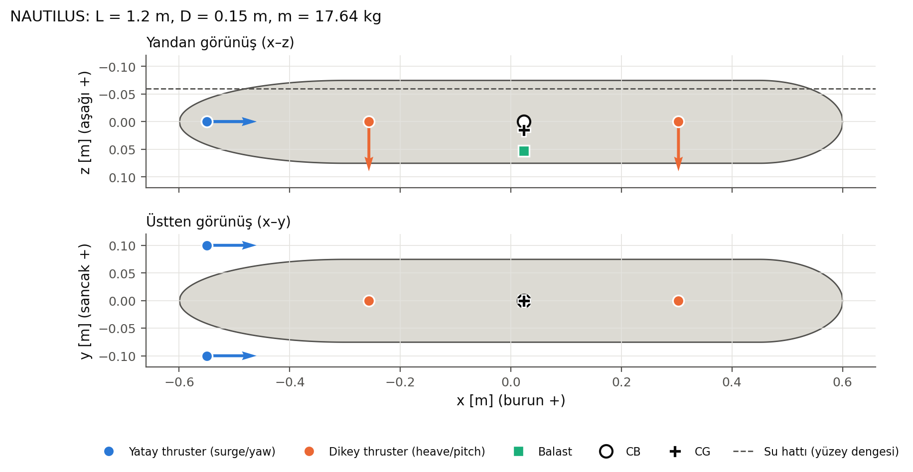
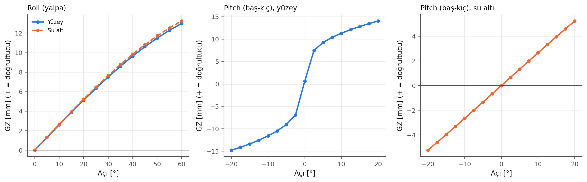
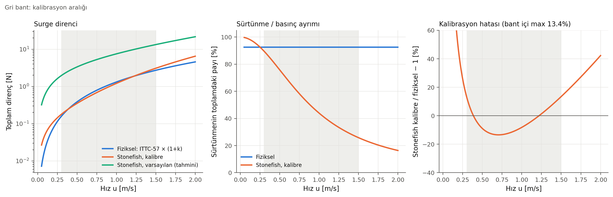

# Faz 1: Araç tasarım parametreleri (onay bekliyor)

Tarih: 2026-10-04. Bu fazda simülasyon çalıştırılmadı. Tüm değerler `config/vehicle.yaml` girdisinden `scripts/design_vehicle.py` ile hesaplandı. Tam tablolar otomatik olarak [`01_tasarim_tablolar.md`](01_tasarim_tablolar.md) dosyasına yazılıyor. Mesh'in Stonefish'te yüklenmesi ve ölçümler Faz 2'de.

```bash
cd ~/stonefish_ws/src/hybrid_vehicle_sim
python3 scripts/design_vehicle.py          # ~30 s
```

Çıktılar:
- `meshes/hull.obj|json`: tek parça, watertight gövde.
- `config/vehicle_derived.yaml`: Faz 2 senaryo üretecinin girdisi.
- `docs/01_tasarim_tablolar.md`
- `figures/faz1/*`

Kod `hybrid_vehicle_sim/` paketinde: `hull`, `hydrostatics`, `mass`, `drag`, `thrusters`. Faz 2–4'te yeniden kullanılacak.

## 1. Önerilen araç



| | Değer | Gerekçe |
|---|---|---|
| Gövde | L = 1.20 m, D = 0.15 m (L/D = 8): kıç yarı-elipsoid 0.30 m + silindir 0.75 m + burun yarı-elipsoid 0.15 m | Tipik küçük AUV oranı; uzun kıç basınç toparlanması için. Tek parça kapalı mesh, çünkü compound hatalı (Faz 0.5). V, S, A_ön analitik olarak doğrulanabilir |
| Hacim / ıslak alan / ön kesit | 18.52 L / 0.527 m² / 176.4 cm² (mesh-tam; analitikten −%0.19 / −%0.06 / −%0.16) | 64 çevresel dilim |
| Kütle | **18.16 kg**; net yüzdürme +%2 (B − W = +3.56 N) | Yüzeyde hafif pozitif; güç kesilince yüzer |
| Kütle dağılımı | Homojen gövde 13.16 kg + iç balast 5 kg (x_CB, z = +5.45 cm) → **BG = 1.50 cm** | Pasif roll/pitch stabilitesi; balast gövde içinde (< 0.8r) |
| Atalet (CG) | Ixx = 0.046, Iyy = 1.276, Izz = 1.266 kg·m² (köşegen) | Gövde mesh'inin tetrahedron integrali + balast, paralel eksen |
| Akışkan | ρ = 1000 kg/m³ (tatlı su), ν = 1.138e-6 m²/s (15 °C) | Havuz testi; Stonefish varsayılan sıcaklığı |
| Thrusterlar | 4 × `simple_thruster`, ±10 N | Aşağıda |
| VBS | Tanımlı, **kapalı**: max 0.6 L → net yüzdürme +3.56 … −2.32 N | Faz 6'da denenecek |

## 2. Yüzey dengesi ve stabilite

| | Yüzey | Su altı |
|---|---|---|
| Su çekimi / fribord | 14.12 cm / **8.8 mm** (hacmin %98.0'ı su altında) | — |
| Statik trim | −0.13° (burun hafif aşağı) | 0 |
| GM_T (roll) | **1.50 cm**. Formül: KB + BM_T − KG = 1.502; GZ eğimi: 1.501 | **1.53 cm** (= BG·B/W) |
| GM_L (pitch) | **26.4 cm** (formül 26.44 / sayısal 26.35); yalnızca ±~0.5°'de geçerli | 1.53 cm |
| Roll / pitch periyodu (ek atalet yok) | — | 0.81 s / 4.30 s |



Yorum:
- **Roll:** Kesitler dairesel olduğu için metasantr her su çekiminde eksende. Bu yüzden yüzeyde ve su altında GM_T ≈ BG; iki eğri neredeyse çakışıyor. Sayısal ve analitik beklenti %0.08 farkla tutuyor.
- **Pitch:** Yüzeyde ince ama uzun su hattı GM_L ≈ 26 cm veriyor. Fribord yalnızca 8.8 mm olduğu için birkaç derecede uçlar su altına giriyor veya çıkıyor ve GZ hızla doğrusallığını kaybediyor. Su altında pitch sertliği yaklaşık 17 kat düşüyor (GM = BG). Yüzey ↔ su altı geçişinin dinamiğini en çok bu değişim etkileyecek (Faz 6).

## 3. İtki yerleşimi ve allocation

| Thruster | Konum [m] | Yön | Rol |
|---|---|---|---|
| ThrusterPort / ThrusterStarboard | (−0.55, ∓0.10, 0) | +x | Surge + diferansiyel yaw |
| ThrusterHeaveBow / ThrusterHeaveStern | (x_CB ± 0.28, 0, 0) = (+0.303 / −0.257, 0, 0) | +z (aşağı) | Heave + diferansiyel pitch |

τ = B·T, CG etrafında (satırlar X, Y, Z, K, M, N), rank = 4:

| | Port | Stbd | Bow | Stern | Kapasite |
|---|---|---|---|---|---|
| X | 1 | 1 | 0 | 0 | 20 N |
| Z | 0 | 0 | 1 | 1 | 20 N |
| M | −0.015 | −0.015 | −0.28 | +0.28 | 5.9 N·m |
| N | +0.10 | −0.10 | 0 | 0 | 2.0 N·m |

- **Kontrol edilebilen eksenler:** X, Z, M, N.
- **Pasif kalanlar:** Y (sway; torpido gövdesinde yanal thruster yok) ve K (roll, BG ile pasif kararlı).
- Yatay thrusterlar eksen hizasında, CG ise 1.5 cm aşağıda. Bu yüzden her 1 N surge itkisi −0.015 N·m pitch (burun aşağı) momenti üretiyor. Dikey thruster farkıyla dengelenebilir (Faz 5 allocation).
- **±10 N gerekçesi (heave):** Yüzeyden dalmak için B − W = 3.6 N, w = 0.3 m/s'deki çapraz akış direnci için ≈ 5.9 N; toplam ≈ 9.5 N, kapasite 20 N.
- **Surge'de itki fazlası:** Tam surge itkisi (20 N) çıplak gövdeye fiziksel olarak 4.5 m/s, kalibre Stonefish'te 3.0 m/s verir; ikisi de çalışma bandının dışında. Hız kontrolcüde ≤ 1.5 m/s ile sınırlanacak.
- **Faz 3'e not:** Bant içi kararlı hızlar (0.3–1.5 m/s) için toplam itki yalnızca ~0.2–3.1 N. "Maksimumun %20/40/60/80'i" seviyeleri (4–16 N) bandın dışına çıkar. Faz 3 seviyeleri N cinsinden, banda göre seçilmeli.
- Yüzey dengesinde dört thruster da 6.6 cm derinlikte, yani suyun içinde. Stonefish itkiyi yalnızca thruster sudan çıkınca keser.

### Alternatif yerleşimler

| Seçenek | Artı | Eksi |
|---|---|---|
| **(a) Önerilen: 2 kıç yatay + 2 dikey tünel** | Düşük hızda ve hover'da heave/pitch kontrolü; yüzeyden kontrollü dalış; allocation basit ve ayrık | 4 aktüatör; tünel thrusterların gerçekte direnç ve verim kaybı Stonefish'te modellenmiyor |
| (b) Tek kıç thruster + rudder/elevator | Enerji verimli, gerçek torpidolara benzer; Stonefish `rudder` lift'i modelliyor | Düşük hızda kontrol yok, hover yok; yüzeyden dalış ancak ileri hızla mümkün |
| (c) Tek dikey thruster (x_CB'de) | Daha basit, 3 aktüatör | Pitch kontrolü yok (pasif BG = 1.5 cm, T ≈ 4.3 s); yüzeyde trim düzeltilemiyor |
| (d) Sadece VBS ile dalış | Sessiz, hover'da enerji harcamıyor | Yavaş (debiye bağlı); Stonefish'te VBS sadece ağırlık ekliyor, ataleti değiştirmiyor; pitch kontrolü yok |

## 4. Direnç ve Stonefish kalibrasyonu (kullanıcı kararı: toplam direnç, bant fiti)

- **Fiziksel referans:** R = ½ρ·S·C_F(Re)·(1+k)·u². C_F = ITTC-1957 = 0.075/(log Re − 2)². Form faktörü (Hoerner) 1+k = 1 + 1.5(D/L)^1.5 + 7(D/L)³ = **1.080**.
  - Sürtünme = ½ρSC_Fu², basınç (viskoz basınç) = k × sürtünme. Sürtünmenin toplamdaki payı her hızda %92.6.
- **Stonefish formu** (Faz 0.5): F = ½ρ·C_d·A_ön·u³ + ρ·C_f·S_t·u. İki katsayı, **minimax göreli hata** ile 0.3–1.5 m/s bandına fit edildi:

| | C_d (x, y, z) | C_f (x, y, z) [m/s] | Bant | Max göreli hata |
|---|---|---|---|---|
| **Kalibre (önerilen)** | 0.0770, 1.778, 1.778 | 0.001036, 0.02175, 0.02175 | surge 0.3–1.5, heave 0.1–0.4 m/s | %13.4 / %11.1 |
| Stonefish varsayılan (tahmini MVAE) | 0.125, 1, 1 | 0.0125, 0.1, 0.1 | — | 1 m/s'de fiziğin 5.7 katı |

| u [m/s] | Fiziksel R [N] (sürt./bas.) | Stonefish kalibre [N] (F_f/F_p) | Hata |
|---|---|---|---|
| 0.3 | 0.157 (0.145 / 0.012) | 0.178 (0.160 / 0.018) | +%13.4 |
| 0.5 | 0.385 (0.357 / 0.029) | 0.351 (0.266 / 0.085) | −%8.9 |
| 1.0 | 1.320 (1.222 / 0.098) | 1.212 (0.532 / 0.680) | −%8.2 |
| 1.5 | 2.726 (2.524 / 0.202) | 3.092 (0.798 / 2.293) | +%13.4 |
| 2.0 (bant dışı) | 4.569 | 6.500 | +%42.3 |



- **Bant genişliği ve hata:** 0.3–1.5 m/s gibi 5 katlık bir bantta bu form fiziksel eğriyi en iyi ±%13 ile yakalayabiliyor. Bant 0.5–1.5 m/s'ye daraltılırsa hata ±%6.6'ya iner.
- **Ayrım fiziksel değil.** Stonefish'te sürtünmenin payı bant boyunca %90'dan %26'ya düşüyor (fizikte sabit %93). Faz 4'te bu açıkça gösterilecek: sim ile ITTC karşılaştırması toplamda anlamlı olacak, bileşen bazında olmayacak.
- **Heave:** Çapraz akış C_D,c = 0.8, A_plan = 0.165 m². Bu bir literatür varsayımı, **doğrulanmadı**. Max hata = %11.1 = 1/9; kuadratik bir hedefin 4 katlık banttaki teorik minimum hatası.

## 5. Ek kütle (Faz 2'de ölçülecek)

| | Surge (x) | Heave/sway (z, y) |
|---|---|---|
| Fiziksel (prolate sferoid L/D = 8, Lamb) | m_a = 0.54 kg (k₁ = 0.029) → **18.70 kg** | m_a = 17.50 kg (k₂ = 0.945) → **35.65 kg** |
| Stonefish (tek skaler: m + ort(m_a), tahmini MVAE) | **27.74 kg** (+%48) | **27.74 kg** (−%22) |

Stonefish'te surge yaklaşık 1.5 kat "ağır", heave yaklaşık 0.8 kat "hafif" davranacak. Bu doğrudan ivmelenme zaman sabitlerine yansır ve Faz 4'teki iki modelin ayrıştığı ikinci büyük nokta.

## 6. Doğrulanan / varsayım / Faz 2'de ölçülecek

| Konu | Durum |
|---|---|
| Mesh kapalı, tutarlı yönlü (Euler = 2); dilimleme ile tetrahedron hacmi farkı 6e-7 | ✅ doğrulandı (bu faz) |
| GM_T = BG (analitik beklenti), GM formül = sayısal (T: %0.02, L: %0.3), balast içeride, atalet köşegen, rank 4 | ✅ doğrulandı (bu faz) |
| Stonefish'in mesh V/S/kaldırma/direncini birebir kullanması | ✅ Faz 0.5 (test mesh'iyle); bu mesh için Faz 2'de tekrar |
| ITTC-57, Hoerner form faktörü, C_D,c = 0.8, Lamb ek kütle | 📚 literatür varsayımı |
| Stonefish MVAE yarı-eksenleri, buna bağlı varsayılan C_d ve ek kütle, etkin atalet | ⏳ Faz 2'de ölçülecek |
| Yüzeyde su çekimi ve trim | ✅ Stonefish'te ölçüldü (nogpu, 90 s serbest yüzme, son 30 s): eksen derinliği 6.610 cm (tahmin 6.619, −%0.13), trim −0.132° (tahmin −0.132°), V_sub = m/ρ. Not: DebugPhysics `cob` alanı köprüde yanlış dönüşümle yayınlanıyor (`ROS2SimulationManager.cpp:768`); fizik etkilenmiyor |

## 7. Riskler

- Thruster kolları ve gövdeleri ile anten/sensör çıkıntıları Stonefish'te hidrodinamik olarak **yok**. Direnç yalnızca çıplak gövdeye ait; gerçek araçta çıkıntılar toplamı tipik olarak 1.5–3 kat artırır.
- **Fribord 8.8 mm.** Yüzeyde çok küçük bir dalga ya da trim bile gövdeyi tamamen batırabilir. Yüzey modunda anten veya kule yok. Gerekirse net yüzdürme %2'den yükseltilebilir.
- `simple_thruster`'da reaksiyon torku, verim kaybı ve ventilasyon yok; itki thruster sudan çıktığı anda sıfırlanıyor.
- Kalibrasyon bant dışında hızla kötüleşiyor (2 m/s'de +%42).

## 8. Onay için sorular

1. Ölçek ve kütle uygun mu: L = 1.2 m, D = 0.15 m, m = 18.16 kg, net yüzdürme +%2, BG = 1.5 cm?
2. Thruster yerleşimi (a) ve ±10 N uygun mu, yoksa surge thrusterları daha küçük mü seçilsin?
3. Kalibrasyon bantları uygun mu: surge 0.3–1.5 m/s (±%13.4), heave 0.1–0.4 m/s (±%11.1)? Yoksa surge 0.5–1.5 m/s'ye daraltılıp ±%6.6'ya mı inilsin?
4. VBS Faz 6'ya kadar kapalı kalsın mı?
