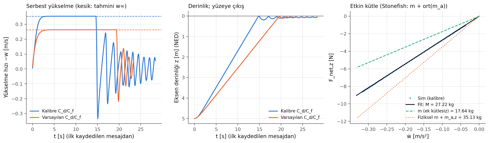
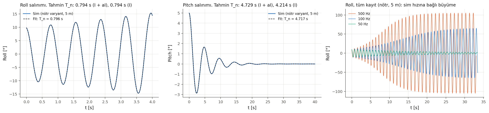
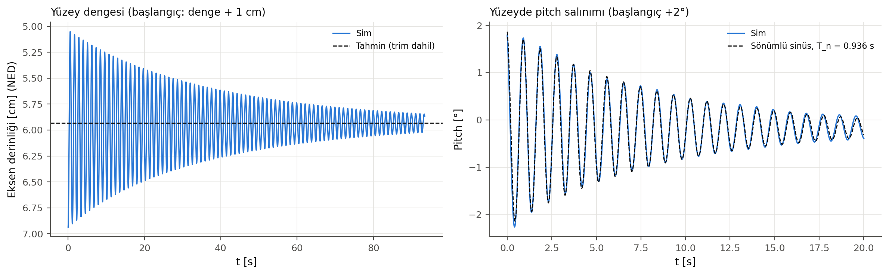

# Faz 2: YAML → senaryo üretimi ve statik testler (onay bekliyor)

Tarih: 2026-10-06. Stonefish `b21eb8e`, stonefish_ros2 `6646e7a`. Kaynak koda **hiçbir düzeltme yapılmadı**.

Kısaltmalar: `SF` = `~/stonefish/Library/src`, `SR` = `~/stonefish_ws/src/stonefish_ros2/src`.

Tüm sayılar otomatik tablolardan: [`02_statik_tablolar.md`](02_statik_tablolar.md). Ham sonuçlar: `02_statik_sonuclar.json`.

## 0. Özet

1. **Faz 1 kararları uygulandı:** net yüzdürme %5, surge bandı 0.5–1.5 m/s. Yeni değerler: m = 17.64 kg, B − W = 8.65 N, fribord 15.6 mm, C_d,x = 0.06323, C_f,x = 0.001329, bant içi hata ±%6.65. Ayrıntı: [`01_tasarim.md`](01_tasarim.md) §0.
2. **Senaryo üreteci taşınabilir oldu.** Mesh yolları göreli, test varyantları bayrakla üretiliyor. Koşu, kayıt ve analiz tek komutla çalışıyor.
3. **49 kabul kriterinin hepsi PASS** (9 koşu).
   - Stonefish bu mesh'in hacmini, yüzeyini, kaldırmasını, ataletini ve katsayılarını 1e-9 düzeyinde birebir kullanıyor.
   - Yüz bazlı direnç formülünün portu, DebugPhysics kuvvetlerini medyan 2e-5 farkla tutuyor.
   - Etkin kütle **M_eff = 27.219 kg**; tahmin m + ort(m_a) = 27.2188 kg (fark 7.5e-6).
4. **Yeni bulgu: `simple_thruster` setpoint'i başlatılmamış.** İlk komut gelene kadar bellekteki rastgele değer itki olarak uygulanıyor. Bir koşuda 4.3e89 N uygulandı ve simülasyon patladı. Sim başlamadan önce sıfır itki yayınlanarak önlendi. Kalıcı düzeltme senin kararın (§1).
5. **Yeni bulgu: dalmış araçta roll salınımı sayısal olarak büyüyor.** 100 Hz'de genlik 6.5 s'de ikiye katlanıyor ve ±65°'de doyuyor.
   - Nedeni: kaldırma momentinin 50 Hz'de tutulmasından gelen gecikme, ve roll sönümünün çok küçük olması (yalnızca C_f,x'ten geliyor; kalibrasyon bunu düşürdü).
   - Kurulan model 50, 100 ve 500 Hz'de ölçümle tutuyor. **50 Hz'de roll kararlı.** Yüzeyde de kararlı (§5).
6. **Faz 3 için kritik: surge direnci hücum açısına aşırı duyarlı.** 1 m/s'de 0.5° hücum açısı direnci +%18, 1° ise +%38 artırıyor. Nedeni Stonefish'in L1 katsayı karışımı ile kalibre katsayıların anizotropisi (§6).
7. **Yüzey dengesi (%5 rezerv):**
   - Eksen derinliği 5.935 cm (tahmin 5.933), trim −0.167° (tahmin −0.168°).
   - Yüzeye çıkışta araç taşıyor (eksen 0.78 cm derinliğe çıkıyor). Heave salınımı çok az sönümlü (ζ = 0.005).

## Faz 2'de değişen ve eklenen dosyalar

| Dosya | Değişiklik |
|---|---|
| `config/vehicle.yaml` | `reserve_buoyancy: 0.05`, `surge_band: [0.5, 1.5]` |
| `scripts/design_vehicle.py` | MVAE tahmini yerine port; `stonefish:` bloğu (yarı-eksenler, varsayılan C_d/C_f, ek kütle, ek atalet, M_eff); görsel `meshes/thruster.obj`; T3/T5/T6/T7 satırları |
| `hybrid_vehicle_sim/mvae.py` (yeni) | Stonefish OBJ yükleyicisi (kopya köşeler dahil) + elipsoid yaklaşımı (MVAE) portu |
| `hybrid_vehicle_sim/drag.py` | `stonefish_added_inertia`; `stonefish_face_forces` (tam dalmış yüz bazlı direnç + C_eff düzeltmesi, kuvvet ve tork) |
| `hybrid_vehicle_sim/simlog.py` (yeni) | Bag okuma, indeks × Δt zaman ekseni, sayım ve dinamik Δt kontrolü, M_eff regresyonu (probe betiklerinden taşındı; probe'lar değişmedi) |
| `scripts/gen_scenario.py` | Göreli mesh yolları; `--depth`, `--rpy`, `--default-hydro`, `--neutral`; 10 anlamlı basamak |
| `scripts/run_sim.sh` | `simulation_data` = paket kökü; açılışta 8 s sıfır itki |
| `scripts/run_case.sh` (yeni) | Tek koşu: senaryo varyantı → bag (sim'den önce) → sıfır itki (sim'den önce) → nogpu sim → kapat |
| `scripts/thrust_cmd.py` (yeni) | Sabit itki vektörü yayını (Faz 3'te profil yayıncısına genişletilecek) |
| `scripts/static_tests.sh`, `scripts/analyze_static.py` (yeni) | 9 koşu; S1–S5, kabul kriterleri, tablolar, JSON, figürler |

Plandan sapmalar:
- **Yüzey testi üç koşuya bölündü.** Plan `surface` koşusunda heave ve pitch'i birlikte uyarmayı öngörüyordu. Tahminî periyotlar yakın (1.11 / 0.93 s) olduğu için ayrı koşular yapıldı (`surface`, `surface_pitch`); yüzey roll'u için `surface_roll` eklendi.
- **Roll koşusu 500 ve 50 Hz'de tekrarlandı.** Amaç büyümenin nedenini ayırmaktı.
- **Planda yanlış bir varsayım vardı.** "`simulation_data` sonunda `/` olmalı" diye düşünmüştüm; köprü bunu zaten kendisi ekliyor (`SR/stonefish_simulator*.cpp:67`).

## Deney düzeni

Hepsi nogpu, itki 0 (sim'den önce yayında). Zaman ekseni: DebugPhysics mesaj indeksi × 1/rate, odometri indeksi × 0.02 s (Faz 0.5 kuralı).

| Koşu | Senaryo | Süre | Test |
|---|---|---|---|
| `depth_release` | Kalibre araç, 5 m, düz | 25 s | S1 yükleme, S3 serbest yükselme |
| `depth_default` | + `--default-hydro` | 20 s | S2 varsayılan katsayılar (MVAE) |
| `surface` | Yüzey dengesi + 1 cm | 90 s | S4 denge, yüzey heave periyodu |
| `surface_pitch` | Yüzey dengesi, pitch +2° | 40 s | S4 yüzey pitch periyodu |
| `surface_roll` | Yüzey dengesi, roll +5° | 40 s | S4 yüzey roll'u |
| `roll_neutral` / `_500` / `_50` | `--neutral`, 5 m, roll 10°; 100 / 500 / 50 Hz | 30 s | S5 roll |
| `pitch_neutral` | `--neutral`, 5 m, pitch 5° | 45 s | S5 pitch, ek atalet |

`--neutral`: kütle = ρV (B = W), CG ve atalet aynı. Neden: Pozitif yüzdüren araç derinlikte durmaz. Sabit itkiyle tutmak ise eğimdeyken gövdeye bağlı itkiden sürüklenme yaratırdı. Ek kütle ve ek atalet kütleden bağımsız olduğu için sonuç gerçek araca aynen geçerli.

Her koşuda otomatik kontroller:
- Sayım oranı 0.9995–1.0000; mesaj düşmesi yok.
- Dinamik Δt (S3) nominalin 0.999–1.000 katı.
- Kaydedilen bütün ThrusterState mesajlarında itki ve tork tam 0.

Kayıt sim'den önce başlıyor, ama ilk ~0.07 s yine de kaydedilmiyor (DDS keşfi). Analizler mutlak t = 0'a ihtiyaç duymayacak şekilde kuruldu.

---

## 1. `simple_thruster` setpoint'i başlatılmamış (yeni bulgu)

**Bulgu.** `SimpleThruster` kurucusu `sThrust` ve `sTorque`'u başlatmıyor. Araç sudayken `Update()` her adımda `thrust = sThrust` uyguluyor. Watchdog varsa bu değer ancak 1 s sonra sıfırlanıyor; watchdog yoksa ilk komuta kadar uygulanmaya devam ediyor.

**Kanıt**
- Kaynak:
  - Kurucu: `SF/actuators/SimpleThruster.cpp:37-48`. `theta`, `thrust` ve `torque` 0'a çekiliyor; `sThrust` ve `sTorque` hiç atanmıyor (başlıkta `:92-93`).
  - Uygulama: `:113-127`.
  - Watchdog: `SF/actuators/Actuator.cpp:64-71` → `SimpleThruster.cpp:171-174`, `setSetpoint(0, 0)`.
- Canlı (sıfır itki önlemi olmadan yapılan ilk koşu seti):
  - `depth_release`: `ThrusterHeaveStern` itkisi **4.34e89 N**. İlk ~97 mesaj boyunca, yani watchdog 1 s'de sıfırlayana kadar sürdü. Simülasyon patladı: ilk kaydedilen mesajda w = −564 m/s, kuvvetler ~1e11 N.
  - `depth_default` ve `surface`: aynı thrusterlarda 3.0e-14 N ve 2.4e-20 N·m. Etkisi yok.
  - Değer bellek içeriğine bağlı; hangi koşuda ne çıkacağı öngörülemiyor.
- Önlem sonrası: 9 koşunun hepsinde kaydedilen itki ve tork tam 0.

**Önlem (uygulandı).** `scripts/thrust_cmd.py` sim başlamadan önce `[0, 0, 0, 0]` yayınlıyor; sim abone olur olmaz setpoint 0 oluyor.
- `run_case.sh` bunu her koşuda yapıyor.
- `run_sim.sh` açılışta 8 s boyunca yapıyor, sonra kendi komutlarına bırakıyor.
- Tamamen garanti değil: sim ilk adımını abonelik eşleşmeden önce atarsa birkaç adım çöp değer uygulanabilir. Bu yüzden her koşuda ThrusterState kontrol ediliyor.

**Faz 0.5'e etkisi.** O koşularda itki komutları sim başladıktan ~5 s sonra geliyordu; çöp değer en fazla o ana kadar uygulanmış olabilir. Ölçüm pencereleri komutlardan sonraydı ve patlama görülmedi. Sonuçlar etkilenmedi.

**Kalıcı düzeltme (senin kararın).** Kurucuya `sThrust = sTorque = Scalar(0);` eklemek tek satırlık bir yama. Faz 0.5 kuralı gereği Stonefish'e dokunmadım. İstersen upstream'e issue da açılabilir; bu dış dünyaya gönderim olduğu için yine senin kararın.

## 2. MVAE portu ve varsayılan katsayılar (S2)

**Bulgu.** Stonefish bu mesh için MVAE iterasyonuna hiç girmiyor (k = 0). Hidrodinamik elipsoid olarak sınırlayıcı kutunun yarı-boyutlarını kullanıyor: (a, b, c) = (0.6, 0.075, 0.075) m. Varsayılan katsayılar C_d = (0.125, 1, 1) ve C_f = 0.1·C_d.

**Mekanizma (port: `hybrid_vehicle_sim/mvae.py`)**
- Yükleyici kopya köşe üretiyor (`SF/utils/GeometryFileUtil.cpp:186-247`): bir konum ilk kullanıldığı normalden farklı bir normalle tekrar gelirse yeni köşe ekleniyor. Bizim OBJ'deki yüz-başı normallerle 3970 konumdan **14208 köşe** çıkıyor.
- Başlangıç ağırlığı, 6 uç noktadan birine eşit olan **her** köşeye 1/6 veriliyor (`SF/entities/SolidEntity.cpp:880-890`). Burun ve kıç uçları 64'er kez tekrarlandığı için ağırlıkların toplamı 1'den çok büyük çıkıyor.
- Sonuçta ilk ε = −0.72, tolerans 0.129'un altında kalıyor ve algoritma doğrudan sınırlayıcı kutu dalına düşüyor (`:964-971`).
- Faz 1'deki "(L/2, r, r)" tahmini bu yüzden birebir doğruydu. Aynı davranışın başka mesh'lerde de görülüp görülmeyeceği **doğrulanmadı**.
- Port tamamen deterministik değil: Refine ve asal eksen döndürme port edilmedi. Bu mesh için ikisi de devreye girmiyor (en büyük yüz eşiğin 0.61'i; atalet tensörü köşegen). Devreye girmeleri gerekirse port hata veriyor.

**Kanıt (canlı, `depth_default`)**
- DebugPhysics C_d = (0.125, 1, 1), C_f = (0.0125, 0.1, 0.1); porttan sapma 0.
- Varsayılan katsayılarla yükselme: w∞ = 0.2633 m/s (tahmin 0.2637).
- Kuvvetler yüz bazlı portla max 3e-5 farkla tutuyor.

## 3. Yükleme ve tutarlılık (S1)

DebugPhysics'in ilk mesajı tahminle şu farklarla tutuyor:

| Büyüklük | Göreli fark |
|---|---|
| Kütle, hacim, yüzey, F_b | ≤ 3e-9 |
| Atalet | ≤ 2.4e-10 |
| CG | 2e-12 m (mutlak) |
| C_d, C_f | ≤ 2.2e-10 |
| Basınç / ρgz | 4.7e-5 |

- Basınç kıyası konular arası zaman hizalamasıyla sınırlı.
- İlk denemede C_f,x 3.6e-6 sapmıştı. Nedeni, senaryoya 8 ondalıkla yazılan değerin yuvarlanmasıydı; üreteç artık 10 anlamlı basamak yazıyor.

## 4. Serbest yükselme: ek kütle ve heave direnci (S3)

**Bulgu.** Etkin kütle M_eff = **27.219 kg**. Bu, Stonefish'in m + ort(m_a) formülüyle (MVAE portu + Lamb, kodtaki haliyle) birebir aynı; fark 7.5e-6. Değer `<hydrodynamics>` override'ından bağımsız: varsayılan katsayılarla oran 0.999998.



- **Yöntem:**
  - Regresyon: F_net = M·ẇ. Kuvvet F_net = F_b + mg + F_p,z + F_f,z (DebugPhysics). Örnekler: dalmış geçiş bölgesi, |F_net| > 1 N, 185 örnek.
  - Artık std 1.8e-4 N; kuvvet–hız hizalaması veriden seçildi.
- **Fiziksel kıyas:**

  | | Fiziksel | Stonefish | Fark |
  |---|---|---|---|
  | Heave kütlesi (m + m_a,z, Lamb) | 35.13 kg | 27.22 kg | −%23 |
  | Surge kütlesi | 18.18 kg | 27.22 kg | +%50 |

  Faz 1 §5'teki öngörü canlı olarak doğrulandı.
- **Terminal yükselme hızı:** w∞ = 0.3545 m/s (tahmin 0.3547, −%0.06).
- **Yüz bazlı direnç portu (`drag.stonefish_face_forces`):**
  - DebugPhysics F_p ve F_f vektörlerini 150 kuvvet güncellemesinde medyan 1.9e-5, en kötü 4.7e-4 göreli farkla tutuyor.
  - Bu, "Stonefish bu mesh'in direncini birebir kullanıyor" iddiasının bu mesh için kanıtı.
- **Eksen formülü ile fark:** Yükselmede pitch 1.4°'ye çıkıyor. Bu yüzden ½ρC_d,z A_plan w³ formülü +%0.06, ρC_f,z S_t,z w formülü +%0.15 sapıyor.
  - Sebep: etkin katsayı kuvvet yönünün L1 karışımı, C_eff = Σ|d_i|·C_i (`SF/entities/SolidEntity.cpp:1263-1287`).
  - φ = 1.4° için 1 + φ·C_f,x/C_f,z − φ²/2 ≈ +%0.12. Port bunu içerdiği için tutuyor.
  - Aynı mekanizmanın surge yönündeki etkisi çok daha büyük: §6.
- **Yüzeye çıkış (bilgi, Faz 6):** Araç 0.355 m/s ile yüzeye çarpıp taşıyor. Eksen 0.78 cm derinliğe kadar çıkıyor; dengede 5.93 cm. Pitch −2.8° … +6.3° aralığında salınıyor. Sonrasında heave salınımı uzun sürüyor (aşağıda ζ = 0.005).

## 5. Roll kararlılığı: 50 Hz tutma gecikmesi (yeni bulgu, S5 ve S4)

**Bulgu.** Nötr araç 5 m'de 10° roll ile bırakıldığında salınım sönmüyor, büyüyor:

| Sim hızı | σ [1/s] (− = büyüyen) | Model σ | 30 s sonra genlik |
|---|---|---|---|
| 500 Hz | −0.228 | −0.236 | ±105° (doyma) |
| 100 Hz | −0.107 | −0.111 | ±65° (doyma) |
| **50 Hz** | **+0.047** | **+0.046** | 9.8° → 2.7° (sönüyor) |

Periyot her hızda tahminle tutuyor: 0.794–0.799 s, tahmin 0.794 s.



**Mekanizma (kaynak ve canlı ölçümle doğrulandı)**
1. **Gecikmeli doğrultucu moment:**
   - Kaldırma kuvveti ve momenti sadece hidrodinamik güncelleme adımlarında hesaplanıyor; aradaki adımlarda aynı değer tekrar uygulanıyor (`SF/entities/SolidEntity.cpp:1799-1834`). Güncelleme her P = round(rate/50) adımda bir yapılıyor (`SF/core/SimulationManager.cpp:582, 1584`).
   - Bu, ortalama τ = (P − 1)·dt/2 gecikme demek: 100 Hz'de 5 ms, 500 Hz'de 9 ms, 50 Hz'de 0.
   - Gecikmeli yay −kθ(t − τ) ≈ −kθ + kτ·θ̇ gibi davranıyor; bu da negatif sönüm σ_gecikme = ω²τ/2 ekliyor.
   - Roll'da ω = 7.9 rad/s yüksek, çünkü I_xx = 0.043 kg·m² küçük ve Stonefish'te roll ek ataleti 0 (`SolidEntity.cpp:1004`, kodda "THIS SHOULD BE > 0" notu var). Sonuç: σ_gecikme = 0.157 (100 Hz).
2. **Çok küçük roll sönümü:**
   - Gövde dönel simetrik olduğu için roll'da form direnci yok; sönüm yalnızca yüzey sürtünmesinden geliyor.
   - Sürtünme torkunun yönü x olduğundan etkin katsayı C_f,x oluyor. Kalibrasyon bunu 0.00133 m/s'ye (varsayılanın 1/9'u) indirdi.
   - Port ile c = 0.0040 N·m·s, σ_fiz = +0.046.
3. **Kararlılık koşulu c > B·BG·τ ve atalete bağlı değil.**
   - 100 Hz'de gereken c 0.0136 N·m·s; mevcut değer bunun 3.4'te biri.
   - Pitch'te sönüm büyük (C_f,z, C_d,z): σ = +0.229, model +0.235. Pitch kararlı.
4. **Doğrultucu momentin kendisi doğru.** DebugPhysics kaldırma torku, gecikme taramasıyla B·BG·sinθ'yı %0.09 (roll) ve %0.02 (pitch) içinde tutuyor.

**Yüzeyde roll kararlı (S4, 100 Hz).** 5°'lik roll 40 s'de 0.0007°'ye sönüyor (σ = +0.065).
- Sebep yine L1 karışımı. Yüzeyde gövdenin üstü kuru ve dönme CG etrafında, bu yüzden sürtünme torkunun y bileşeni var (|d_y| ≈ 0.42).
- Böylece C_eff ≈ 8.2·C_f,x oluyor ve c = 0.0196 N·m·s'ye çıkıyor (dalmışta 0.0040). Bu da 100 Hz eşiğinin (0.013) üstünde.
- c DebugPhysics'ten alınınca model σ = +0.076 veriyor; ölçülen +0.065.

**Ek kütle ve atalet (S5)**
- Pitch ek ataleti **aI_y = 0.310 kg·m²**; Stonefish formülü πρb²a³/12 = 0.318 verir (−%2.5, tolerans içinde). Periyot 4.717 s, tahmin 4.729 s. Ek atalet olmasaydı periyot 4.214 s olurdu.
- Roll ek ataleti ölçümde 0.0003 kg·m², yani sıfırla uyumlu (kodda 0).

**Faz 3–6'ya etkisi (karar senin)**
- Saf surge ve heave testlerinde roll uyarılmıyor; `surface` koşusunda roll 90 s boyunca 5e-7° kaldı. Faz 3–4 doğrudan etkilenmez.
- Faz 5'teki yaw manevraları ve dalgalar roll'u uyaracak. 100 Hz'de dalmış araçta genlik 6.5 s'de ikiye katlanır ve ±65°'ye gider. Bu kabul edilemez.
- Seçenekler:
  - **(a) Sim hızı 50 Hz (önerim).** P = 1 olduğu için gecikme yok; roll kararlı ve ölçüldü. Hidrodinamik zaten 50 Hz'de güncelleniyordu; değişen tek şey integrasyon adımının 20 ms olması. Faz 3'te S1–S3'ün 50 Hz'de kısa bir tekrarıyla doğrulanmalı.
  - (b) Stonefish yaması: kaldırmayı her adımda hesaplamak. Kaynak değişikliği gerekiyor.
  - (c) BG'yi 0.44 cm'nin altına indirmek: pasif stabilite zayıflar, önermiyorum.
  - (d) C_f,x'i artırmak: surge kalibrasyonunu bozar.

## 6. Faz 3 için kritik: surge direnci hücum açısına aşırı duyarlı (port ile hesap)

**Bulgu.** Kalibre katsayılar çok anizotropik: C_d,z/C_d,x = 28, C_f,z/C_f,x = 16. Stonefish etkin katsayıyı kuvvet yönünün L1 karışımıyla hesapladığı için, akış gövdeye göre küçük bir α açısıyla eğilince x direnci hızla büyüyor:

| u [m/s] | α = 0.25° | 0.5° | 1° | 2° |
|---|---|---|---|---|
| 0.5 | +%5.7 | +%11.6 | +%23.6 | +%49 |
| 1.0 | +%9.0 | +%18.3 | +%37.8 | +%81 |
| 1.5 | +%11.3 | +%23.0 | +%47.9 | +%103 |

Bu, doğrulanmış yüz bazlı portla yapılmış bir hesap; canlı surge testi Faz 3'te. Fiziksel bir narin gövdede 1°'de direnç artışı %1'in altında olur. Yani bu, Stonefish'e özgü bir artefakt.

**Faz 3'e etkisi**
- **Pitch kaynağı:** Yatay thrusterlar eksende, CG ise 1.5 cm aşağıda. Her 1 N surge itkisi −0.015 N·m pitch momenti üretiyor. 1 m/s'de (T ≈ 1.24 N) bu ≈ 0.4° burun aşağı demek.
- Araç yatay giderse α ≈ 0.4° olur ve direnç ~%15 şişer. Bu, ±%6.65'lik kalibrasyon hatasından büyük.
- Pozitif yüzdürme (8.65 N) derinlik tutmayı gerektiriyor; tutma kusurlu olursa w ≠ 0 olur ve α = atan(w/u) yine direnci büyütür.
- **Faz 3 planına öneri:**
  - Diferansiyel dikey itkiyle pitch momentini açık çevrimde dengelemek: kıç dikey thruster +0.027·T_x, baş −0.027·T_x (0.28 m kol, 0.015 m kaldıraç).
  - Her kararlı pencerede α'yı DebugPhysics'ten raporlamak ve |α| < 0.05° kabul kriteri koymak (bu açıda artış 0.5–1.5 m/s'de %1.1–2.3).
  - Gerekirse direnç testlerini nötr varyantta yapmak.

## 7. Yüzey dengesi ve yüzey salınımları (S4)

| | Ölçülen | Tahmin |
|---|---|---|
| Eksen (orijin) derinliği, son 30 s | 5.935 cm | 5.933 cm (trim dahil); trimsiz 5.943 |
| Trim | −0.167° | −0.168° |
| Roll | 5e-7° | 0 |
| V_sub | m/ρ (+3e-5) | m/ρ |
| Heave periyodu (bilgi) | 1.124 s, ζ = 0.005 | 1.114 s (M_eff, ρgA_wp) |
| Pitch periyodu (bilgi) | 0.936 s, ζ = 0.017 | 0.930 s (GM_L = 40.7 cm, I + aI) |
| Roll periyodu (bilgi) | 0.813 s, σ = +0.065 | 0.813 s (GM_T = 1.50 cm) |



- Fribord 15.6 mm; tüm thrusterlar 5.9 cm derinlikte.
- Yüzey periyotları doğrusal tahminlerle %1 içinde tutuyor. Pitch'te 2°'lik sekant GM_L −%6 fark veriyor; genlik sönünce doğrusal değer geçerli oluyor.
- Heave neredeyse sönümsüz (ζ = 0.005). Bu, Faz 0.5'teki "dalga radyasyon sönümü yok" gözlemiyle tutarlı. Faz 6'da yüzey ↔ su altı geçişlerinde araç onlarca saniye salınacak.
- Yüzeyde heave ve pitch'te de aynı 50 Hz tutma gecikmesi etkili olmalı. Sönüm bütçesine etkisi ölçülmedi (**doğrulanmadı**).

## 8. Doğrulanmadı / açık noktalar

- 50 Hz sim hızında S1–S4'ün tekrarı (yalnızca roll 50 Hz'de koşuldu).
- Surge yönünde hücum açısı duyarlılığının canlı testi (§6, Faz 3).
- `thrust_cmd.py` önleminin her durumda ilk adımları kapsadığı (her koşuda ThrusterState ile kontrol ediliyor; 9/9 temiz).
- MVAE'nin k = 0'a düşmesinin başka mesh'lerde de olup olmadığı.
- Yüzeyde heave ve pitch sönüm bütçesi; dalgalı denizde davranış (GUI şart, Faz 6).
- DebugPhysics `submerged_volume` tam dalmışken 0 raporlanıyor (Faz 0 bulgusu, yeniden görüldü). Fiziği etkilemiyor.

## 9. Onay için sorular

1. **Sim hızı:** Faz 3'ten itibaren 50 Hz'e geçilsin mi? (Önerim: evet; Faz 3'ün başında S1–S3 50 Hz'de tekrar doğrulanır.) Alternatifler: 100 Hz'de kalıp roll sorununu Faz 5'e bırakmak, ya da Stonefish'te kaldırmayı her adımda hesaplayan bir yama.
2. **`simple_thruster` yaması:** Kaynakta tek satırlık düzeltme yapılsın mı, yoksa mevcut sıfır-itki önlemi yeterli mi? (Önerim: önlem yeterli; yamaya şimdilik gerek yok.)
3. **Faz 3 direnç testleri:** Derinlikte, açık çevrim pitch dengelemesiyle ve |α| < 0.05° kriteriyle mi; yoksa nötr varyantta mı yapılsın? (Önerim: önce gerçek araç + pitch dengeleme; α kriteri tutmazsa nötr varyant.)

## Yeniden üretme

```bash
cd ~/stonefish_ws/src/hybrid_vehicle_sim
python3 scripts/design_vehicle.py                 # config -> mesh, derived YAML, Faz 1 tabloları
scripts/static_tests.sh                           # 9 koşu, ~10 dk -> bags/faz2/
source /opt/ros/humble/setup.bash && source ~/stonefish_ws/install/setup.bash
python3 scripts/analyze_static.py                 # -> docs/02_statik_tablolar.md, docs/02_statik_sonuclar.json, figures/faz2/
# tek koşu: ONLY="surface_roll" scripts/static_tests.sh
```
